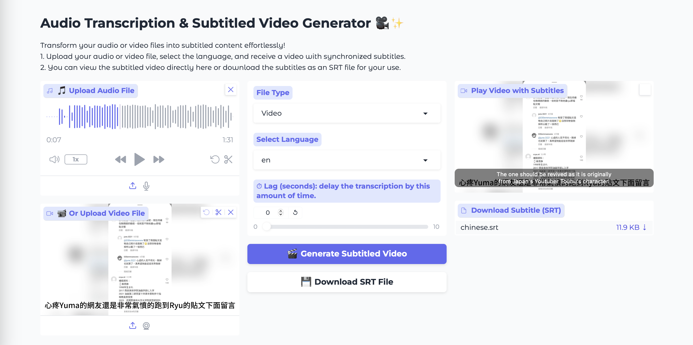

# AudioVisualTranscription

[](https://huggingface.co/spaces)

Get your synchronized subtitled video in minutes with AI!



## 📜 Overview

**AVT** is a tool that allows you to precisely subtitle your audio or video
content in minutes, using the power of AI.

Whether you need subtitles for accessibility, language learning, or just to make
your content more engaging, this app has got you covered. Simply upload your audio
or video file, select the language, and let the magic happen.

## ✨ Features

- **Easy-to-use Interface**: Powered by [Gradio](https://gradio.app) for an
  intuitive user experience.
- **Multi-Language Support**: Supports transcription in multiple languages:
  English, Spanish, French, German, Italian, Dutch, Russian, Norwegian, Chinese,
  and more.
- **Video Playback**: View your subtitled video directly in the web app.
- **Download Subtitles**: Save generated subtitle files for use with your preferred
video player.

## 🚀 Quickstart

The easiest way to use **AVT** is through this
[Hugging Face Space](https://huggingface.co/spaces/nelikCode/AudioVisualTranscription).

To use it locally, follow the steps below.

### Installation

Follow these steps to set up the application on your local machine.

1. **Clone the repository**:

    ```bash
    git clone https://github.com/killian31/AudioVisualTranscription
    cd AudioVisualTranscription
    ```

2. **Create a Python environment** using pyenv:

    ```bash
    pyenv virtualenv 3.11.9 avt
    pyenv activate avt
    ```

3. **Install Poetry**:

    ```bash
    pip install poetry
    ```

4. **Install dependencies**:

    ```bash
    poetry install
    ```

5. **Install system-level dependencies**:
    - **MacOS**: Run the following script to install FFmpeg and ImageMagick.

      ```bash
      bash ./install_macos.sh
      ```

    - **Debian/Ubuntu**: Run the following commands to install FFmpeg and ImageMagick.

      ```bash
      chmod +x install_linux.sh
      ./install_linux.sh
      ```

### Running the App

To launch the Gradio app:

```bash
python app.py
```

After launching, navigate to the provided local URL to interact with the
application in your browser.

## 📊 How It Works

1. **Upload Your Content**: Use the provided options to upload an audio file
   **or** a video file. Select the file type accordingly in the dropdown menu
   (Video, Audio).
2. **Select Your Preferences**: Choose the language of transcription and any
   delay settings you prefer.
3. **Generate Subtitles**: Click on the “Generate Subtitled Video” button to
   process your input.
4. **Download or View**: View the subtitled video directly on the web interface
   or download the SRT subtitle file for later use. You need to generate the
   subtitles before being able to ckick on the download button.

## 🛠 Requirements

The app relies on the following system-level dependencies:

- **[FFmpeg](https://ffmpeg.org/)**: Required for handling video and audio.
- **[ImageMagick](https://imagemagick.org/)**: Required for video processing.

Please ensure these are installed using the provided scripts before running the app.

## 📚 Technologies Used

- **Gradio**: Provides the web interface for easy interaction.
- **Whisper by OpenAI**: Performs speech recognition.

## 🤝 Contributing

Contributions are welcome! If you'd like to improve the app or add new features,
feel free to fork the repository and open a pull request. Please format your code
with `black`.

## 📄 License

This project is open source and available under the [Apache 2.0 License](LICENSE).

## ✉️ Contact

If you have any questions, feel free to
[open an issue](https://github.com/killian31/AudioVisualTranscription/issues/new).
